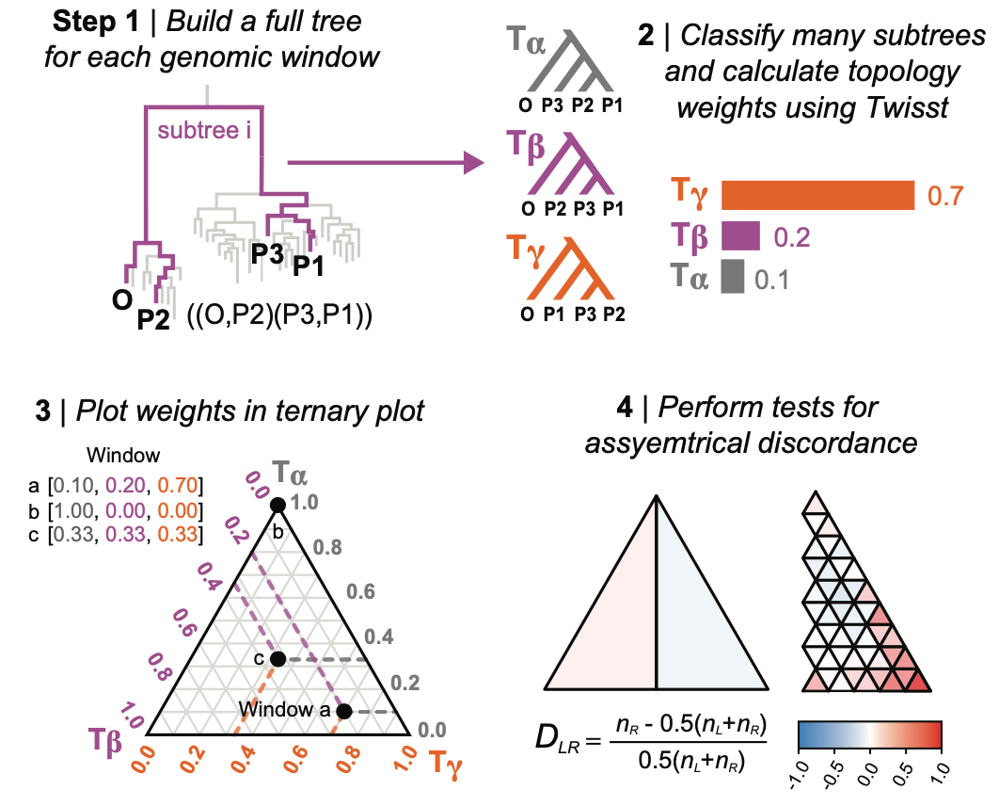

# TWISSTNTERN


## A method for analysing topology weights in a ternary framework

TWISSTNTERN is an analytical framework for visualising and analysing topology weights in a ternary plot. This is a modernized, command-line version that can calculate topology weights directly from tree files or analyze pre-computed weights from CSV files.

## What does TWISSTNTERN do?

In a tree with four populations, there are only 3 possible unrooted subtrees that can be observed for each sampled subtree. This makes a ternary plot a natural framework for analyzing the joint distribution of weights, as it is possible to graphically represent each genomic window as a single point based on the three topology weights.

The three corners of the ternary plot, [1,0,0], [0,1,0], [0,0,1], correspond with genomic windows that show taxon-level relationships that are consistent with one of the three possible subtrees; that is, 100% of the sampled subtrees perfectly match one of the three alternative trees, implying that samples from each of the four groups are monophyletic. In contrast, the very center of the ternary plot—[0.33,0.33,0.33]—corresponds with a genomic window where all three of the possible subtrees were sampled at equal frequency. Any other location in the ternary plot indicates a bias toward one of the subtrees, but with some resemblance to at least one of the other alternative topologies.

In an idealized four population model (3 splits with no migration), we expect the distribution of weights for many loci to be biased toward the top of the triangle which represents the subtree that matches the demographic history. Incomplete lineage sorting will generate a symmetrical distribution of weights between the left and right sides of the plot. This is because there is an equal chance that any discordant gene tree will more-closely resemble either alternative topology. However, processes like gene flow result in an asymmetrical pattern of discordance between the left and right halves of the triangle. The strength of the genealogical asymmetry (and its significance) can be quantified using the D_LR statistic, which is similar to the site-based statistic, Patterson's D. D_LR can be calculated at the genome-wide scale (two full half-triangles), or between left-right sub-triangles so that one can see how the strength of the asymmetry varies among loci that show different levels of discordance.



## Installation

You can install the package in one of the following ways:

### 🛠️ Option 1: Install from GitHub

```bash
pip install git+https://github.com/HilaLifchitz/twisstntern_v2
```

### 🛠️ Option 2: Development Mode (recommended for contributors)

```bash
pip install -r requirements.txt
pip install -e .[dev]
```

---

### Input

**Tree File Options:**

- **TreeSequence** (`.trees`, `.ts`): TSKit tree sequence files
- **Newick** (`.newick`, `.nwk`, `.tree`): Single or multiple Newick format trees
- **Nexus** (`.nexus`): Nexus format files

**Weights Data Files:**

- **CSV** (`.csv`): Pre-computed topology weights (no normalization required)

---

### 🔧 Command-Line Usage

**TWISSTNTERN** accepts both tree files and pre-computed topology weights. The input file can be specified either as a positional argument or using the `--input` flag.

```bash
python -m twisstntern INPUT [GRANULARITY] [OPTIONS]
```

#### **Parameters**

- `INPUT`: **(Required)** Input file path - tree file (`.trees`, `.newick`, `.nwk`, `.tree`, `.nexus`) or topology weights CSV `.csv`.
- `--granularity`: _(Optional, default: `0.1`)_  
  Sets the resolution of the ternary triangle analysis. Accepts either a float (e.g., `0.05`) or a keyword (`coarse`, `fine`, `superfine`).  
  Smaller values produce finer subdivisions of the triangle and more detailed results.
- `-i`, `--input`: Alternative way to specify input file
- `-o`, `--output`: Output directory (default: `Results/`)
- `--taxon-names`: Space-separated taxon names for Newick/Nexus files (e.g., `O P1 P2 P3`)
- `--outgroup`: Outgroup taxon name for Newick/Nexus files
- `--topology-mapping`: _(Optional)_  
  Manually specify which topology corresponds to each axis label (T1, T2, T3) in the ternary plot.  
  Useful for ensuring consistency across runs or datasets. Format:  
  `'T1="(0,(3,(1,2)))"; T2="(0,(1,(2,3)))"; T3="(0,(2,(1,3)))";'`
- `--verbose`: Enable verbose logging (DEBUG level)
- `--help`: Show help message

#### **Input Methods**

```bash
# Method 1: Positional arguments
python -m twisstntern input_file.trees

# Method 2: Using --input flag
python -m twisstntern --input input_file.trees

# Method 3: Combined with granularity
python -m twisstntern input_file.trees 0.25
```

#### **Basic Examples**

**TreeSequence files** (no additional parameters needed):

```bash
# Default analysis with granularity 0.1
python -m twisstntern data.trees

# Custom granularity using positional argument
python -m twisstntern data.trees 0.05

# Custom granularity using flag
python -m twisstntern data.trees --granularity fine

# Specify output directory
python -m twisstntern data.trees --output /custom/output/dir/
```

**Newick/Nexus files** (require taxon names and outgroup):

```bash
# Basic Newick analysis
python -m twisstntern tree.newick --taxon-names O P1 P2 P3 --outgroup O

# With custom granularity
python -m twisstntern tree.newick --granularity superfine --taxon-names O P1 P2 P3 --outgroup O

# With verbose logging
python -m twisstntern tree.newick --taxon-names O P1 P2 P3 --outgroup O --verbose
```

**Pre-computed CSV files**:

```bash
# Analyze topology weights CSV
python -m twisstntern weights.csv

# With specific granularity
python -m twisstntern weights.csv fine
```

#### **Advanced Examples**

**Custom topology mapping**:

```bash
# For TreeSequence files (population IDs: 0, 1, 2, 3)
python -m twisstntern data.trees \
  --topology-mapping 'T1="(0,(3,(1,2)))"; T2="(0,(1,(2,3)))"; T3="(0,(2,(1,3)))";'

# For Newick files (population names: O, P1, P2, P3)
python -m twisstntern tree.newick \
  --taxon-names O P1 P2 P3 --outgroup O \
  --topology-mapping 'T1="(O,(P3,(P1,P2)))"; T2="(O,(P1,(P2,P3)))"; T3="(O,(P2,(P1,P3)))";'
```

---

#### 🌳 Topology Mapping

**TWISSTNTERN** now supports **custom topology ordering** for phylogenetic analyses. By default, topologies are labeled T1, T2, T3 based on the order they are discovered by twisst. However, you can specify which topology should be assigned to each label using the `--topology-mapping` argument.

#### **Format**

```bash
--topology-mapping 'T1="(topology1)"; T2="(topology2)"; T3="(topology3)";'
```

#### **Examples**

**For TreeSequence files** (population IDs: 0, 1, 2, 3):

```bash
python -m twisstntern data.trees \
  --topology-mapping 'T1="(0,(3,(1,2)))"; T2="(0,(1,(2,3)))"; T3="(0,(2,(1,3)))";'
```

**For Newick files** (population names: O, P1, P2, P3):

```bash
python -m twisstntern data.newick \
  --taxon-names O P1 P2 P3 --outgroup O \
  --topology-mapping 'T1="(O,(P3,(P1,P2)))"; T2="(O,(P1,(P2,P3)))"; T3="(O,(P2,(P1,P3)))";'
```

#### 🧪 Granularity Settings

Control the resolution of the triangle-based analysis using the `--granularity` argument. Supported predefined values:

| Keyword     | Value  |
| ----------- | ------ |
| `coarse`    | `0.25` |
| `fine`      | `0.1`  |
| `superfine` | `0.05` |

You can also provide a **custom float value** for granularity (alpha), e.g. `--granularity 0.01`.  
**Note:** `1 / alpha` must be an **even integer**.

- ✅ Valid example: `0.01` → `1 / 0.01 = 100`
- ❌ Invalid example: `0.2` → `1 / 0.2 = 5`

---

### **Output**

TWISSTNTERN generates a comprehensive set of output files saved to the specified output directory (default: `Results/`):

**Analysis Files:**

- `[prefix]_topology_weights.csv` - Raw topology weight data for each genomic window
- `[prefix]_triangle_analysis.csv` - Triangle-based sub-analysis results with statistics
- `twisstntern_YYYYMMDD_HHMMSS.log` - Detailed log file with complete analysis record

**Visualization Files:**

- `[prefix]_fundamental_asymmetry.png` - Fundamental asymmetry bar chart showing left vs right bias
- `[prefix]_analysis_granularity_[value].png` - Ternary plot with data points colored by triangle regions
- `[prefix]_granuality_[value].png` - Main ternary plot with density visualization and statistical overlays
- `[prefix]_index_granularity_[value].png` - Triangle index visualization showing region boundaries

**File Naming:**

- `[prefix]` is derived from the input filename (e.g., `data.trees` → `data_`)
- `[value]` represents the granularity setting used (e.g., `0.1`, `0.05`)

**Example Output (granularity 0.1):**

```
Results/
├── data_topology_weights.csv
├── data_triangle_analysis.csv
├── data_fundamental_asymmetry.png
├── data_analysis_granularity_0.1.png
├── data_granuality_0.1.png
├── data_index_granularity_0.1.png
└── twisstntern_20250618_151932.log
```

---

#### 📝 Logging

**TWISSTNTERN** includes comprehensive logging to track analysis progress and results. Every analysis automatically generates a detailed log file saved to the output directory.

#### **Log File Creation**

- **Automatic**: Log files are created for every analysis run
- **Location**: Saved in the output directory (default: `Results/`)
- **Format**: `twisstntern_YYYYMMDD_HHMMSS.log`

#### **Logging Levels**

```bash
# Standard logging (INFO level)
python -m twisstntern input.csv

# Verbose logging (DEBUG level) for detailed technical information
python -m twisstntern input.newick --taxon-names O P1 P2 P3 --outgroup O --verbose
```

#### **What Gets Logged**

- **System Information**: Python version, platform, package versions
- **Analysis Parameters**: Input file, granularity, taxon names, topology mapping
- **Processing Steps**: File format detection, tree processing, statistical analysis
- **Topology Information**: Complete topology details with both string representations and ASCII tree diagrams
- **Results Summary**: Fundamental asymmetry values, file generation, timing
- **Error Context**: Detailed error messages with helpful suggestions
<!--

#### **Console vs File Output**

- **Console**: Clean, colored progress messages for real-time feedback
- **Log File**: Complete technical details with timestamps and module context, including detailed topology logging -->

<!-- #### **Topology Logging**

When processing tree files (Newick, TreeSequence), TWISSTNTERN automatically logs detailed topology information to the log file, including:

- **Topology Strings**: Simplified Newick format for each topology (e.g., `(O,((P1,P2),P3));`)
- **ASCII Tree Diagrams**: Beautiful visual representations of each topology structure
- **Topology Labels**: Clear identification of T1, T2, T3 assignments -->

<!--
**Example Topology Log Content:**

```
2025-06-17 17:12:42,554 - INFO - Newick file topologies (default order)
2025-06-17 17:12:42,555 - INFO - ==================================================
2025-06-17 17:12:42,555 - INFO - T1:
2025-06-17 17:12:42,555 - INFO -   String: (O,((P1,P2),P3));
2025-06-17 17:12:42,555 - INFO -   ASCII Tree:
2025-06-17 17:12:42,555 - INFO -        /-O
2025-06-17 17:12:42,555 - INFO -       |
2025-06-17 17:12:42,555 - INFO -     --|      /-P1
2025-06-17 17:12:42,555 - INFO -       |   /-|
2025-06-17 17:12:42,555 - INFO -        \-|   \-P2
2025-06-17 17:12:42,555 - INFO -          |
2025-06-17 17:12:42,555 - INFO -           \-P3
2025-06-17 17:12:42,556 - INFO - T2:
2025-06-17 17:12:42,556 - INFO -   String: (O,((P1,P3),P2));
2025-06-17 17:12:42,556 - INFO -   ASCII Tree:
...
``` -->

---

### 🐍 Python Interface

You can also use TWISSTNTERN as a Python module:

```python
from twisstntern import run_analysis

# Basic usage
results, fundamental_results, csv_file = run_analysis(
    file="your_file.trees",
    granularity=0.1
)

# With topology mapping
results, fundamental_results, csv_file = run_analysis(
    file="your_file.trees",
    granularity=0.1,
    topology_mapping='T1="(0,(3,(1,2)))"; T2="(0,(1,(2,3)))"; T3="(0,(2,(1,3)))";'
)

# For Newick files
results, fundamental_results, csv_file = run_analysis(
    file="your_file.newick",
    granularity=0.1,
    taxon_names=["O", "P1", "P2", "P3"],
    outgroup="O",
    topology_mapping='T1="(O,(P3,(P1,P2)))"; T2="(O,(P1,(P2,P3)))"; T3="(O,(P2,(P1,P3)))";'
)
```

---

## 🧬 Simulating Data with `twisstntern_simulate`

The `twisstntern_simulate` module lets you generate simulated tree sequence data and analyze it using the same ternary pipeline as the main package.  
It is ideal for testing, benchmarking, and exploring different demographic scenarios.

- Runs simulations using `msprime`
- Automatically Downloads Twisst from https://github.com/simonhmartin/twisst
- Saves trees in Newick format with standardized taxon names
- Automatically passes simulated data to the analysis pipeline
- Outputs CSVs and plots in a structured results directory

---

### Input

Simulation parameters (demography, sample sizes, sequence length, etc.) are specified in a YAML file.  
See `config_template.yaml` for a template and documentation of available options.

---

### 🔧 Command-Line Usage

The only required input is a configuration file provided via the `--config` flag.

```bash
python -m twisstntern_simulate -c CONFIG[-o OUTPUT][--skip-twisst-check][--force-download][--verbose][--quiet][--log-file LOG_FILE][--seed SEED][--granularity GRANULARITY]
```

- `-c`, `--config`: **(Required)** Path to a YAML configuration file specifying simulation parameters (see `twisstntern_simulate/config_template.yaml` for an example).
- `-o`, `--output`: (Optional) Output directory for results. Defaults to `Results/`.
- `--skip-twisst-check`: Skip checking for the TWISST executable.
- `--force-download`: Force re-download of the TWISST executable.
- `--verbose`: Enable verbose logging.
- `--quiet`: Suppress most output.
- `--log-file LOG_FILE`: Write logs to a file.
- `--seed SEED`: Set a random seed for reproducibility.
- `--granularity GRANULARITY`: Set analysis granularity (overrides config).

**Example:**

```bash
python -m twisstntern_simulate -c config_template.yaml -o SimResults/
```

---

### ⚙️ Configuration Overrides

You can override any configuration parameter from the YAML file directly via the command line using the `--override` argument. This is useful for testing different parameter values without editing the configuration file.

#### **Format**

```bash
--override 'parameter_path=value'
```

#### **Supported Override Types**

**Top-level parameters:**

```bash
# Override random seed
--override 'seed=1234'

# Override ploidy
--override 'ploidy=2'

# Override simulation mode
--override 'simulation_mode=locus'
--override 'simulation_mode=chromosome'
```

**Migration rates** (format: `migration.source>destination=rate`):

```bash
# Set migration rate from population p2 to p3
--override 'migration.p2>p3=0.5'

# Set migration rate from population p1 to p2
--override 'migration.p1>p2=0.1'
```

**Population parameters** (format: `populations.population_name.parameter=value`):

```bash
# Override effective population size
--override 'populations.p1.Ne=5000'

# Override sample size
--override 'populations.p2.sample_size=20'
```

#### **Multiple Overrides**

You can specify multiple overrides in a single command:

```bash
python -m twisstntern_simulate -c config.yaml -o results/ \
  --override 'migration.p1>p2=0.1' \
  --override 'populations.p1.Ne=5000' \
  --override 'ploidy=2'
```

#### **Examples**

**Basic migration override:**

```bash
python -m twisstntern_simulate -c config_template.yaml -o test_migration/ \
  --override 'migration.p2>p3=0.3'
```

**Multiple parameter override:**

```bash
python -m twisstntern_simulate -c config_template.yaml -o test_params/ \
  --override 'migration.p1>p2=0.1' \
  --override 'populations.p1.Ne=5000' \
  --override 'ploidy=2' \
  --topology-mapping 'T1=(0,(1,(2,3))); T2=(0,(2,(1,3))); T3=(0,(3,(1,2)));'
```

#### **What Gets Logged**

All applied overrides are automatically logged to the output log file with before/after values:

```
Override applied: migration.p2>p3: 0.0 -> 0.3
Override applied: populations.p1.Ne: 1000.0 -> 5000
Override applied: ploidy: 1 -> 2
```

The detailed configuration section in the log will show the final parameter values used in the simulation, incorporating all overrides.

### 📝 Output

All results are saved to the specified output directory.  
If no directory is provided, a default `Results/` folder will be created automatically.

In addition to the standard `twisstntern` outputs (weights, CSVs, plots), this module also saves the simulated trees `msprime` generated in Newick format.

**Integration:**  
You can use the outputs from `twisstntern_simulate` directly with the main `twisstntern` analysis tools for further exploration.

---

## 📚 Citation

If you use **TWISSTNTERN**, please cite:

**Stankowski, S., Zagrodzka, Z. B., Garlovsky, M. D., Pal, A., Shipilina, D., Garcia Castillo, D., Lifchitz, H., et al.** (2024). _The genetic basis of a recent transition to live-bearing in marine snails_. **Science**, 383(6678), 114–119. [https://doi.org/10.1126/science.adi2982](https://doi.org/10.1126/science.adi2982)

> This study is the first to use the TWISSTNTERN method to examine patterns of tree discordance in _Littorina_.

Also cite the original topology weighting method:

**Martin, S. H., & Van Belleghem, S. M.** (2017). _Exploring evolutionary relationships across the genome using topology weighting_. **Genetics**, 206(1), 429–438. [https://doi.org/10.1534/genetics.116.194720](https://doi.org/10.1534/genetics.116.194720)

---

## Dependencies

- `numpy>=1.21.0`
- `pandas>=1.3.0`
- `scipy>=1.7.0`
- `matplotlib>=3.4.0`
- `tskit>=0.4.0`
- `msprime>=1.0.0`
- `ete3>=3.1.0`
- `requests>=2.25.0`

---

## Contributing

Feedback, issues, and enhancement suggestions are welcome!  
To install in development mode and test the CLI:

```bash
pip install -r requirements.txt
pip install -e .
python -m twisstntern --help
python -m twisstntern_simulate --help
```
